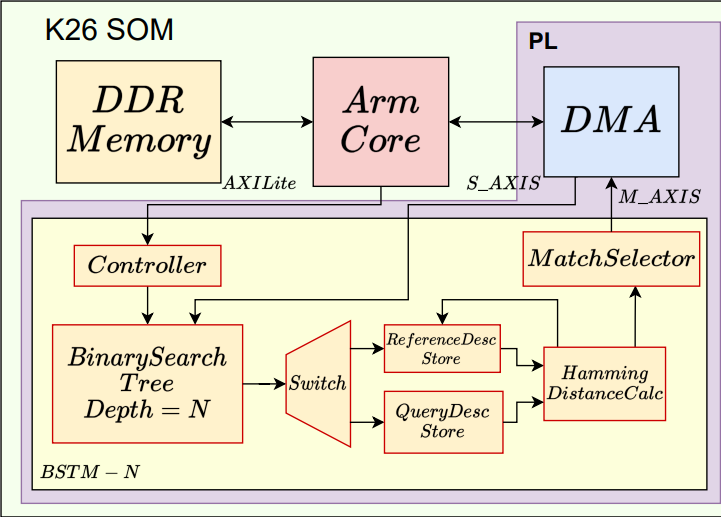
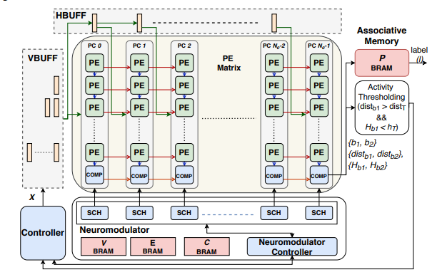
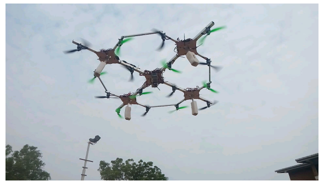

<!-- SEO + Structured Data (works even for one-page sites) -->
<meta name="description" content="PhD candidate at NTU, Singapore working on FPGA-accelerated, energy-efficient Stereo Visual SLAM and RISC-V hardware/software co-design for edge robotics." />

<!-- Optional but nice for social previews -->
<meta property="og:title" content="Miyuru Thathsara | FPGA-Accelerated Stereo Visual SLAM (NTU)" />
<meta property="og:description" content="FPGA-accelerated Stereo Visual SLAM, feature extraction, stereo matching, and hardware/software co-design for edge robotics." />
<meta property="og:type" content="website" />
<meta property="og:url" content="https://MiyuruThathsara.github.io/" />

<!-- Structured data: helps Google understand your identity -->

<h2>Overview</h2>

  
As a PhD Researcher at NTU, Singapore, I develop real-time, resource-efficient Visual SLAM systems by combining algorithm design with FPGA-based acceleration on embedded platforms. My research has produced top-tier first-author publications on stereo visual SLAM, feature matching, and hardware-efficient keypoint selection, with demonstrated improvements in latency and energy efficiency. I’m motivated by building systems that are both scientifically solid and practical to deploy.

  <h2>Activities &amp; Hobbies</h2>

  

    <ul style="list-style: none; padding-left: 0; margin: 0.5rem 0 1rem 0;">
      <li>Badminton, cricket, and chess</li>
      <li>Enjoy sharing knowledge with the research community</li>
    </ul>
  

  <h2>Contact</h2>

  

    <ul style="list-style: none; padding-left: 0; margin: 0.5rem 0 0 0;">
      <li>Personal Email: <a href="mailto:mthathsara@outlook.com">mthathsara@outlook.com</a></li>
      <li>Work Email: <a href="mailto:miyuruth001@e.ntu.edu.sg">miyuruth001@e.ntu.edu.sg</a></li>
      <li>Google Scholar: <a href="https://scholar.google.com/citations?user=_F2z9wYAAAAJ&amp;hl=en">Miyuru Thathsara</a></li>
      <li>LinkedIn: <a href="https://lk.linkedin.com/in/miyuru-thathsara-07596518b">Miyuru Thathsara</a></li>
      <li>GitHub: <a href="https://github.com/MiyuruThathsara">MiyuruThathsara</a></li>
    </ul>
  

## Current: Research Focus

Algorithm–architecture co-design for real-time stereo visual SLAM on FPGA SoCs, with emphasis on efficient salient keypoint extraction, descriptor matching, keypoint/keyframe selection, and system-level optimization under tight power constraints.

## Research Interests
<ul class="ri-grid">
  <li>Computer architecture</li>
  <li>Low-power edge AI systems</li>
  <li>Domain-specific accelerators (DSA)</li>
  <li>RISC-V co-processors</li>
  <li>Hardware/software co-design</li>
  <li>Adaptive / reconfigurable hardware</li>
</ul>

---

## Selected Publications

  

    

      <iframe
        src="https://www.youtube.com/embed/vtGebB7Yoc8?autoplay=1&mute=1&loop=1&playlist=vtGebB7Yoc8&controls=1&rel=0&modestbranding=1"
        title="FPGA Stereo Visual SLAM Demo"
        allow="autoplay; encrypted-media; picture-in-picture"
        allowfullscreen>
      </iframe>
    

  

  

    
FPGA Stereo Visual SLAM with Efficient Stereo Feature Matching and Key-frame Generation

    
<em>(FPL 2025 — First Author) • Accepted</em>

    <ul class="pub-points">
      <li>First FPGA SoC implementation of stereo visual SLAM</li>
      <li>Reduced stereo matching latency via <strong>region-aware + similarity-based descriptor grouping</strong></li>
      <li>Proposed <strong>tracking-status-based keyframe generation</strong> to avoid unnecessary map expansion and improve stability</li>
      <li>Validated on benchmarks + real-world experiments</li>
    </ul>
  

  

    <!-- Replace this placeholder with your own image file, e.g., assets/img/fpt24.png -->
    
  

  

    
Hardware-Efficient Homogenized Key-Point Selection for Visual SLAM

    
<em>(FPT 2024 — First Author • Technology Disclosure)</em> • <a href="https://ieeexplore.ieee.org/abstract/document/11113393">Paper</a>

    <ul class="pub-points">
      <li>Real-time FPGA accelerator for <strong>uniform keypoint selection</strong> in streaming video</li>
      <li>Grid-based streaming architecture + efficient neighbor sorting for dynamic input sizes</li>
      <li>Improves robustness and resource efficiency while meeting real-time constraints</li>
    </ul>
  

  

    <!-- Replace this placeholder with your own image file, e.g., assets/img/iscas24.png -->
    
  

  

    
Hardware Accelerator for Feature Matching with Binary Search Tree

    
<em>(ISCAS 2024 — First Author • Patent Pending)</em> • <a href="https://ieeexplore.ieee.org/document/10558431">Paper</a>

    <ul class="pub-points">
      <li>Stream-processing FPGA matcher using a <strong>balanced BST</strong> + <strong>ratio-test</strong> outlier rejection</li>
      <li>~<strong>12× faster</strong> than linear exhaustive search on FPGA</li>
      <li>Scalable, resource-efficient design</li>
    </ul>
  

  

    <!-- Replace this placeholder with your own image file, e.g., assets/img/fpl20.png -->
    
  

  

    
Dynamically Growing Neural Network Architecture for Lifelong Deep Learning on the Edge

    
<em>(FPL 2020 — Co-author 2nd)</em> • <a href="https://ieeexplore.ieee.org/document/9221575">Paper</a>

    <ul class="pub-points">
      <li>FPGA architecture for lifelong learning with efficient scheduling/resource reuse</li>
      <li>Designed to meet tight edge constraints</li>
      <li>Reported strong results on Core50</li>
    </ul>
  

  

    <!-- Replace this placeholder with your own image file, e.g., assets/img/iciafs18.png -->
    
  

  

    
Feasibility Study of a Novel Cross Assembled Multi-quadrotor UAV

    
<em>(ICIAfS 2018 — Acknowledged)</em> • <a href="https://ieeexplore.ieee.org/document/8913338">Paper</a>

    <ul class="pub-points">
      <li>Proof-of-concept prototype and stabilization validation</li>
      <li>Demonstrated control reuse from single-quadrotor design with minimal changes</li>
      <li>Plug-and-play replacement concept for improved robustness</li>
    </ul>
  

---

## Experience
**Project Officer (Research)**, HESL, SCSE, NTU Singapore *(Jul 2022 – Jan 2023)* 
&nbsp;&nbsp;Designed and developed a visual SLAM algorithm on FPGA SoC (system prototyping and acceleration) 
**Engineer, Accelerated Systems (HWAC Team)**, LSEG Technologies Sri Lanka *(May 2021 – Aug 2022)* 
&nbsp;&nbsp;Developed a **customized multi-channel AXI DMA engine**, later integrated with LSEG market data disemmination pipeline 
&nbsp;&nbsp;Worked on **partial reconfiguration support** for hardware acceleration workflows 
**Research Assistant**, HESL, SCSE, NTU Singapore *(Jul 2019 – Dec 2019)* 
&nbsp;&nbsp;Developed **streaming hardware architectures** for deep learning and a self-organization map classifiers 
**Research Assistant**, UAV Lab, University of Moratuwa *(Jan 2018 – Dec 2018)* 
&nbsp;&nbsp;Designed and developed a multi-rotor controller hexacopter platform

---

## Education
**PhD Candidate**, College of Computing and Data Science, Nanyang Technological University, Singapore *(2025 – Present)* 
**PhD Student**, College of Computing and Data Science, Nanyang Technological University, Singapore *(2023 – 2025)* 
**BSc (Hons) Electronics and Telecommunication Engineering (First Class)**, University of Moratuwa, Sri Lanka *(2016 – 2021)* 
&nbsp;&nbsp;GPA **3.74/4.2** • Key modules: Digital IC Design (A+), Advanced Digital Systems (A+) 
**Certificate Level in Management**, Achievers Lanka Business School *(2015 – 2016)* 
**High School: Nalanda College, Colombo** *(2002 – 2015)* 
&nbsp;&nbsp;Z-score **2.5017** (Island Rank **119**) • A grades: Combined Mathematics, Chemistry, Physics • 9 A’s (O/L)

---

## Awards & Achievements
**NTU Research Scholarship Awardee** — 2023 (4 years) 
**Dean’s List** — University of Moratuwa (Semesters 1, 2, 3, 6, 8) 
**Distinction** — 2014 Olympiad Mathematics Competition 
**Chess** — School team captain (2005–2010); All Island 25th (Individual) • Provincial 5th (Individual) • All Island 3rd (Team) ×2

  

  <h2>Activities &amp; Hobbies</h2>
  <ul>
    <li>Badminton, cricket, and chess</li>
    <li>Enjoy sharing knowledge with the research community</li>
  </ul>

  <h2>Contact</h2>
  <ul>
    <li>Personal Email: <a href="mailto:mthathsara@outlook.com">mthathsara@outlook.com</a></li>
    <li>Work Email: <a href="mailto:miyuruth001@e.ntu.edu.sg">miyuruth001@e.ntu.edu.sg</a></li>
    <li>Google Scholar: <a href="https://scholar.google.com/citations?user=_F2z9wYAAAAJ&amp;hl=en">Miyuru Thathsara</a></li>
    <li>LinkedIn: <a href="https://lk.linkedin.com/in/miyuru-thathsara-07596518b">Miyuru Thathsara</a></li>
    <li>GitHub: <a href="https://github.com/MiyuruThathsara">MiyuruThathsara</a></li>
  </ul>

